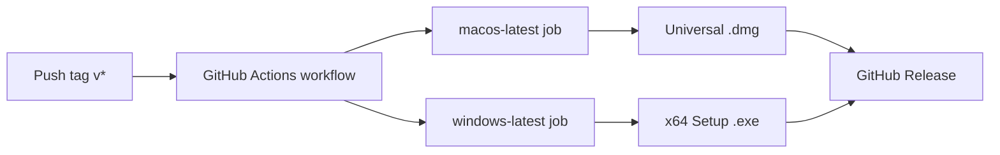

# GitHub Actions Release Build Design

**Date:** 2026-07-03  
**Status:** Approved (brainstorming)  
**Scope:** Add CI/CD to build unsigned macOS (Universal DMG) and Windows (x64 NSIS) installers on version tags and publish them to GitHub Releases.

## Summary

This project (`n8n-in-electron`) is an Electron desktop shell that spawns a local n8n server. Today it has no packaging tooling or GitHub Actions workflows. This design adds `electron-builder` configuration, a small runtime path fix for packaged n8n binaries, and a tag-triggered GitHub Actions workflow that builds both platforms in parallel and publishes artifacts to GitHub Releases.

## Requirements (confirmed)

| Item | Decision |
|---|---|
| Trigger | Push `v*` tags only (e.g. `v0.1.0`) |
| Publishing | Official GitHub Releases (not draft, not pre-release) |
| Code signing | None for now (unsigned builds) |
| macOS artifact | Universal DMG (Intel + Apple Silicon in one package) |
| Windows artifact | x64 NSIS installer (`.exe`) |
| Push to `main` | Does not trigger builds |

## Approach

**Selected: electron-builder + GitHub Actions** (recommended over electron-forge or manual electron-packager scripts).

Rationale:

- Mature Electron packaging ecosystem with first-class Universal DMG and NSIS support.
- Straightforward GitHub Releases integration via `softprops/action-gh-release`.
- Code signing can be added later by supplying secrets and build fields without restructuring CI.

Rejected alternatives:

- **electron-forge:** Weaker NSIS story and less turnkey release publishing for this use case.
- **electron-packager + custom scripts:** High maintenance for DMG/NSIS/Release assembly.

## Architecture



### Components

1. **`electron-builder` config** in `package.json` — defines targets, files, and asar unpack rules.
2. **`src/main.js` path fix** — resolves the n8n binary correctly when `app.isPackaged` is true.
3. **`.github/workflows/release.yml`** — tag-triggered CI with parallel macOS/Windows builds and a publish job.

### Versioning

- Tag format: `v{semver}` (e.g. `v0.1.0`).
- Workflow strips the leading `v` and passes `0.1.0` to `electron-builder` via environment variable or CLI flag.
- Release title uses the tag name; release body is auto-generated from commits.

## Packaging Configuration

### New dependencies and scripts

```json
"devDependencies": {
  "electron-builder": "^25.x"
},
"scripts": {
  "build": "electron-builder",
  "build:mac": "electron-builder --mac",
  "build:win": "electron-builder --win"
}
```

### `build` field (electron-builder)

| Key | Value | Notes |
|---|---|---|
| `appId` | `com.n8n-in-electron.app` | Application identifier |
| `productName` | `n8n` | Display name in installers |
| `directories.output` | `dist/` | Build output directory |
| `mac.target` | `dmg` with `arch: universal` | Single DMG for Intel + Apple Silicon |
| `win.target` | `nsis` with `arch: x64` | Standard Windows installer |
| `nsis.oneClick` | `false` | Allow custom install directory |
| `files` | `src/**`, `package.json` | Electron app code (packed into asar) |
| `extraResources` | `node_modules` → `node_modules` | Full n8n dependency tree in `resources/node_modules/` (outside asar, executable by child process) |

### n8n binary path resolution (`src/main.js`)

Development (unchanged):

```javascript
path.join(__dirname, '..', 'node_modules', '.bin', binName)
```

Packaged:

```javascript
path.join(process.resourcesPath, 'node_modules', '.bin', binName)
```

`resolveN8nBinary()` checks `app.isPackaged` and selects the appropriate base path. Windows continues to use `n8n.cmd` with `shell: true` on spawn.

### Expected artifacts

| Platform | Filename pattern |
|---|---|
| macOS | `dist/n8n-{version}-universal.dmg` |
| Windows | `dist/n8n Setup {version}.exe` |

Package size is expected to be large (300–600 MB) because the full n8n dependency tree is bundled.

## GitHub Actions Workflow

**File:** `.github/workflows/release.yml`

### Trigger

```yaml
on:
  push:
    tags:
      - 'v*'
```

### Permissions

```yaml
permissions:
  contents: write
```

Required for creating GitHub Releases and uploading release assets.

### Jobs

| Job | Runner | Steps |
|---|---|---|
| `build-mac` | `macos-latest` | checkout → setup Node 22 → `npm ci` → `npm run lint` → `npm test` → `npm run build:mac` → upload artifact |
| `build-windows` | `windows-latest` | Same as macOS, ending with `npm run build:win` |
| `publish` | `ubuntu-latest` | Download both artifacts → create/update GitHub Release → attach `.dmg` and `.exe` |

### Environment variables

| Variable | Value | Purpose |
|---|---|---|
| `CSC_IDENTITY_AUTO_DISCOVERY` | `false` | Disable code-signing auto-detection |
| Version (derived) | From `GITHUB_REF` | `refs/tags/v0.1.0` → `0.1.0` for electron-builder |

### Publish job

Uses `softprops/action-gh-release@v2`:

- `draft: false`
- `generate_release_notes: true`
- Uploads all files from downloaded artifacts

### Estimated CI duration

| Phase | Per platform |
|---|---|
| `npm ci` | 5–10 min |
| lint + test | ~10 s |
| electron-builder | 3–5 min |
| **Total** | ~10–15 min |

macOS and Windows jobs run in parallel; wall-clock time is ~15 min (queue-dependent).

## Error Handling

| Scenario | Behavior |
|---|---|
| `npm ci`, lint, or test fails | Job fails immediately; no artifact; no Release |
| `electron-builder` fails | Platform job fails; `publish` does not run (`needs` dependency) |
| One platform succeeds, one fails | Entire release is blocked (no partial Release) |
| Tag does not match `v*` | Workflow does not trigger |
| Same tag pushed again | Workflow re-runs; existing Release is updated |

## Testing Strategy

### In CI (this project)

- Run existing unit tests (`npm test` covering `src/config.js`) in each build job before packaging.
- Run `npm run lint` in each build job.

### Not in CI (out of scope)

- End-to-end test launching Electron + n8n (requires graphical environment; high cost).
- Packaged-app smoke testing on real machines (manual verification after first Release).

## Out of Scope

- Code signing (macOS) and notarization
- Windows Authenticode signing
- Linux builds
- Auto-update (`electron-updater`)
- Builds on push to `main`
- Custom application icons (use electron-builder defaults; add `build/icon.icns` / `build/icon.ico` later)

## Files to Create or Modify

| File | Change |
|---|---|
| `package.json` | Add `build` config, `electron-builder` devDependency, build scripts |
| `package-lock.json` | Updated by `npm install electron-builder` |
| `src/main.js` | Update `resolveN8nBinary()` for packaged paths |
| `.github/workflows/release.yml` | New workflow |
| `.gitignore` | Ensure `dist/` is ignored |
| `README.md` | Document how to cut a release (tag push) |

## Release Process (user-facing)

1. Bump `version` in `package.json` (optional but recommended for consistency).
2. Commit and push to `main`.
3. Create and push a tag: `git tag v0.1.0 && git push origin v0.1.0`
4. GitHub Actions builds both platforms and publishes a Release with DMG and EXE attached.
5. Users download from the Releases page. macOS users may need to right-click → Open for unsigned apps; Windows may show SmartScreen warnings.

## Future Extensions

- Add Apple Developer and Windows signing certificates via GitHub Secrets.
- Add `workflow_dispatch` for manual rebuilds without a new tag.
- Add custom icons and app metadata (author, copyright).
- Consider `arm64`-only or split macOS builds if Universal package size is prohibitive.
